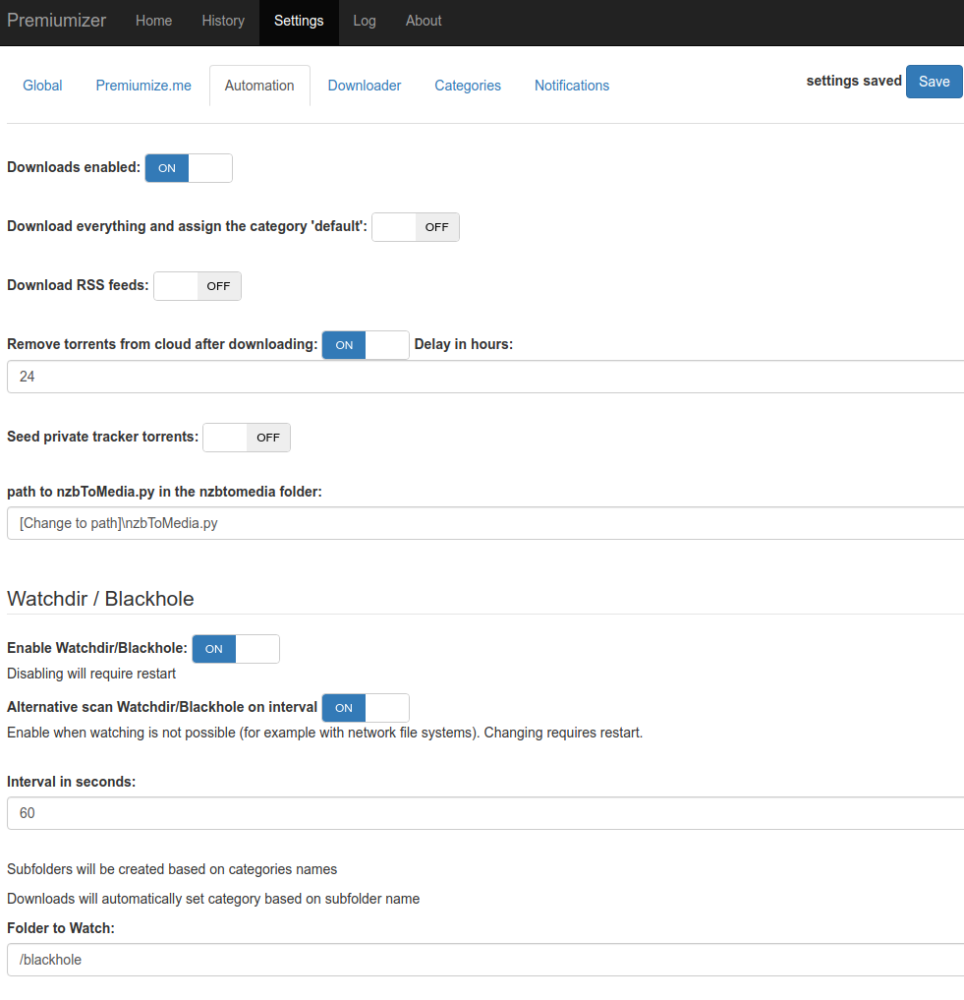
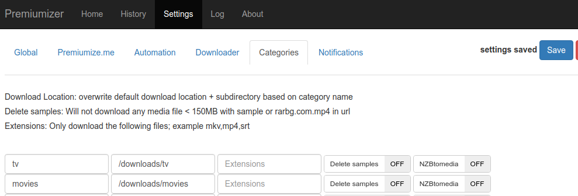
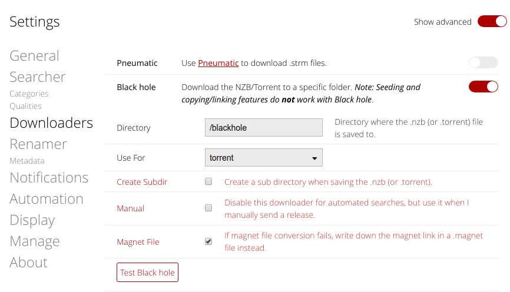
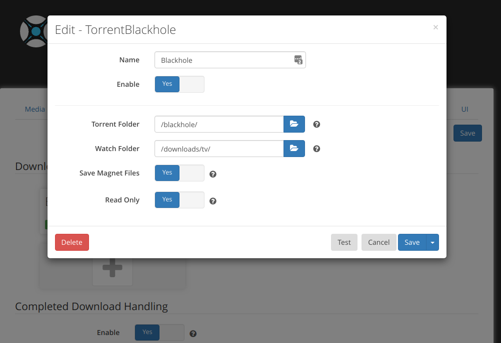

# Premiumizer

Premiumizer is a download management tool for premiumize.me cloud downloads.

  - Web interface to manage premiumize.me downloads: cloud Torrent & Nzb and Filehosts links
  - Category based automatic downloader of finished cloud tasks to local file system
  - Picks up new taks through black hole
  - Integrates with nzbToMedia (post processing)

## About premiumize.me
Premiumize.me combines anonymous cloud torrent downloads, usenet and premium hosters in one subscription. Cloud torrent downloads are cached, meaning if some other premiumize.me member downloaded the torrent through premiumize.me before, you can immediately download the files from that torrent over HTTPS at top speeds.

Get your account [right here](https://www.premiumize.me/ref/198754075).

## How does this thing work?
This tool will monitor your download tasks on premiumize.me.
Once the download in the cloud finishes and the download task has a category that needs to be automatically downloaded premiumizer will start downloading all the files to your local premiumizer server. Download tasks without a category will not be automatically downloaded to the local server.
You can add/change a category whilst it's downloading through the web interface, but third party tools like CouchPotato and SickRage will automatically submit download tasks with a specific category.

When enabled, premiumizer can inform nzbToMedia whenever the local download is finished.
Categories can be setup through the web interface's setup page.

## Web Interface
By default, premiumizer's web interface listens on port 5000.
When premiumizer is running you can access it at http://localhost:5000/

## Installation

### Requirements
Required: Git & Python 3.7 (with pip)
Optional: [virtualenv](https://pypi.python.org/pypi/virtualenv) & [NzbToMedia](https://github.com/clinton-hall/nzbToMedia) version 10.14 & higher

### Synology
Follow Docker instructions.

### Windows
#### Installer
[PremiumizerInstaller](https://github.com/neox387/PremiumizerInstaller/releases)

Open services.msc & edit Premiumizer service to logon using your account that is an administrator.

#### Manual

1. Install [Git](https://git-scm.com/download/win) & select: "Use git from the windows command prompt".
2. Download [Python](https://www.python.org/downloads/)
3. Open cmd.exe
```
$ git clone https://github.com/piejanssens/premiumizer.git premiumizer
$ pip.exe install virtualenv
$ virtualenv premiumizer\env
$ env\Scripts\activate.bat
$ pip install -r requirements.txt
$ python premiumizer.py
```

### Unix / macOS

1. Install Python 3.7 (e.g. using [brew](http://brew.sh/))
2. Open Terminal
```
$ brew install python3
$ git clone https://github.com/piejanssens/premiumizer.git premiumizer
$ cd premiumizer
$ pip install virtualenv
$ virtualenv -p /usr/local/bin/python3 env
$ source env/bin/activate
$ pip install -r requirements.txt
$ python premiumizer/premiumizer.py
```

### Docker

#### General
You need to set the correct PUID and PGID equal to the user that has rw access to the mounted volumes.

```
docker run -d -p 5000:5000 -e TZ=Europe/London -e PUID=1000 -e PGID=1000 -v <host_path>:/premiumizer/conf -v <host_path>:/blackhole -v <host_path>:/downloads piejanssens/premiumizer:latest
```

#### Synology DSM
1. Create a folder using File Station where Premiumizer can store its config and logs (e.g. /volume1/docker/premiumizer)
2. Identify (or create) the locations for blackhole and downloads that Premiumizer will use
3. SSH into your syno and figure out the PUID and PGID of the user that has access to these folders
4. Open Docker app
5. Under 'Registry': Download the piejanssens/premiumizer image
6. Under 'Image': Select the image and click 'launch'
7. Map a port of your chosing to '5000' (e.g. Chosing 5555 to 5000, means your Premiumizer will be accessible through 5555)
8. Map your blackhole folder to '/blackhole'
9. Map your downloads folder to '/downloads'
10. Map your premiumizer conf folder to '/premiumizer/conf'
11. Set the following environment variables
-- PUID (see step 3.)
-- PGID (see step 3.)
-- TZ (e.g. Europe/London)

##### Updating
1. Under 'Container': Stop the container
2. Under 'Container': Action -> Clear
2. Under 'Registry': Download the piejanssens/premiumizer image (this will pull in the latest image)
3. Under 'Container': Start the container

## Updating
Update from the settings page / enable automatic updates
Update button & changes will be displayed when an update is available.

## Settings
Once you can access the premiumizer web interface make sure you head over to the settings page.

## Development
Want to contribute? Great!
Just fork the github repo, do some awesome stuff and create a pull request.

Report issues or feature enhancements/requests on the [Issues](https://github.com/piejanssens/premiumizer/issues) page

# Setting up Sonarr/Couchpotato to use Premiumizer

To utilize premiumizer as a downloader for [Sonar](https://sonarr.tv) or [CouchPotato](https://couchpota.to) style projects, configure these projects to use the Black Holes that premiumizer monitors.  For example, consider the following excerpt from a [docker-compose.yml](https://gist.github.com/drmikecrowe/43929be99a22a083aaf6421460d52d19) file:

```yml
# CouchPotato – Movie Download and Management
  couchpotato:
    image: "linuxserver/couchpotato"
    hostname: couchpotato
    container_name: "couchpotato"
    volumes:
      - ./docker/couchpotato:/config
      - ./docker/Downloads/blackhole/movies:/blackhole
      - ./docker/Downloads/completed/movies:/downloads
      - ./NAS/Movies:/movies
    ports:
      - "5050:5050"
    expose:
      - 5050
    restart: unless-stopped
    environment:
      - PUID=1000
      - PGID=1000
      - UMASK_SET=002
      - TZ=America/New_York
      - VIRTUAL_HOST=couchpotato.${HOST_DOMAIN}
      - VIRTUAL_PORT=5050

# Sonarr – TV Show Download and Management
  sonarr:
    image: "linuxserver/sonarr"
    hostname: sonarr
    container_name: "sonarr"
    volumes:
      - ./docker/sonarr:/config
      - ./docker/Downloads/blackhole/tv:/blackhole
      - ./docker/Downloads/completed:/downloads
      - ./NAS/TV:/tv
      - "/etc/localtime:/etc/localtime:ro"
    ports:
        - "8989:8989"
    expose:
      - 8989
    restart: unless-stopped
    environment:
      - PUID=1000
      - PGID=1000
      - TZ=America/New_York
      - VIRTUAL_HOST=sonarr.${HOST_DOMAIN}
      - VIRTUAL_PORT=8989

# Premiumizer -- Generic Downloader
  premiumizer:
    image: "piejanssens/premiumizer"
    hostname: premiumizer
    container_name: "premiumizer"
    volumes:
      - ./docker/premiumizer:/premiumizer/conf
      - ./docker/Downloads/blackhole:/blackhole
      - ./docker/Downloads/completed:/downloads
      - "/etc/localtime:/etc/localtime:ro"
    ports:
      - "5000:5000"
    expose:
      - 5000
    restart: unless-stopped
    environment:
      - PUID=1000
      - PGID=1000
      - TZ=America/New_York
      - VIRTUAL_HOST=premiumizer.${HOST_DOMAIN}
```

## Premiumizer

Premiumizer is downloading from `blackhole` inputs to a `completed` directory structure.  For example, in the above setup, this would map to the following directories:

```
docker/Downloads/completed
docker/Downloads/completed/movies
docker/Downloads/completed/tv
docker/Downloads/blackhole
docker/Downloads/blackhole/movies
docker/Downloads/blackhole/tv
```

Each searcher is files into the `docker/Downloads/blackhole/movies` or `docker/Downloads/blackhole/tv` directory respectively for Premiumizer to pick up.  Once downloaded, Premiumizer downloads the files into the appropriate `docker/Downloads/completed/movies` or `docker/Downloads/completed/tv` directory.

Configure the Premiumizer blackhole settings as follows:



Configure Premiumizer categories as follows:



## CouchPotato

Configure CouchPotato with a `blackhole` strategy.  Ensure each will download magnet files.



## Sonarr

**NOTE**: Take note of the mapping of the `./docker/Downloads/completed:/downloads` directory for Sonarr.  For CouchPotato, we are directly mapping to `./docker/Downloads/completed/movies:/downloads`.  Lesson: Sonarr expects completed downloads to be in the `/downloads/tv` subdirectory (i.e. `tv` category), whereas CouchPotato simply expects completed movies to be in the `/downloads` directory.

Add a `blackhole` downloader to Sonarr as follows:



